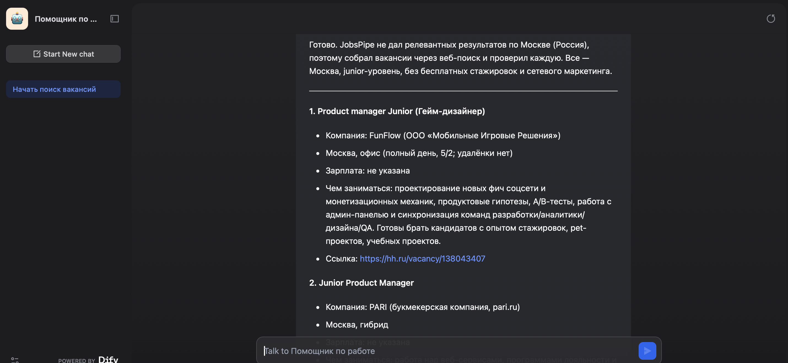

# ИИ-агент для поиска вакансий Junior Product Manager

Агент, который ищет вакансии junior product manager в Москве и отдаёт
готовый список со ссылками — вместо часов ручного поиска.

## Проблема
Поиск вакансий junior PM в Москве занимал часы: разрозненные сайты,
много нерелевантного, дубли одной позиции на разных площадках.

## Решение
ИИ-агент, собранный без кода в конструкторе Dify. Продуманы критерии
отбора, написана инструкция для агента, подключены инструменты поиска.

## Как работает
1. Пользователь пишет запрос — например, «найди junior PM в Москве».
2. Агент ищет вакансии через подключённые инструменты.
3. Фильтрует: только Москва, только junior, без дублей.
4. Отдаёт список: должность, компания, формат, зарплата, ссылка.

## Инструменты
- **Dify** — конструктор агента
- **Tavily** — поиск в интернете
- **JobsPipe** — агрегатор вакансий

## Демо

## Файлы проекта
- `agent.yml` — исходник агента (DSL)
- `prompt.txt` — текст инструкции для агента
- `screenshots/` — скриншоты работы

## Что дальше
- Фильтр по зарплате и формату работы
- Чтение вакансий из Telegram-каналов
